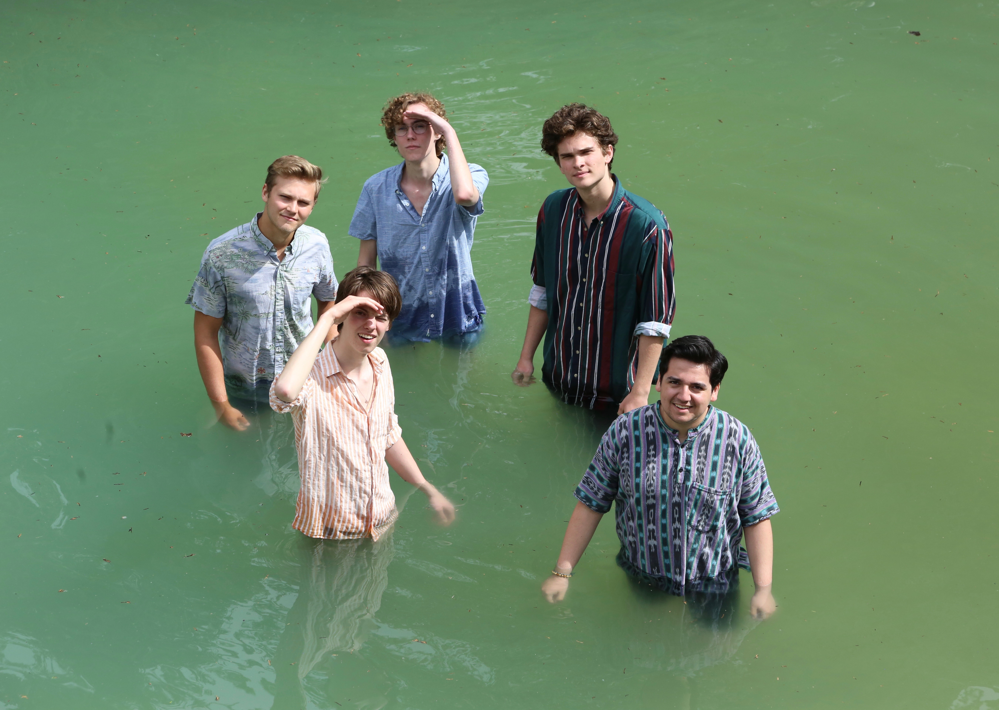
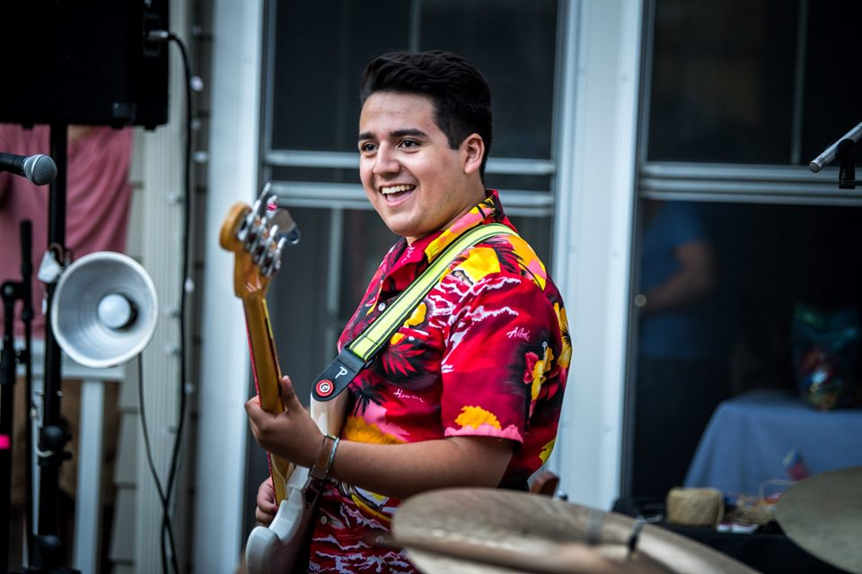
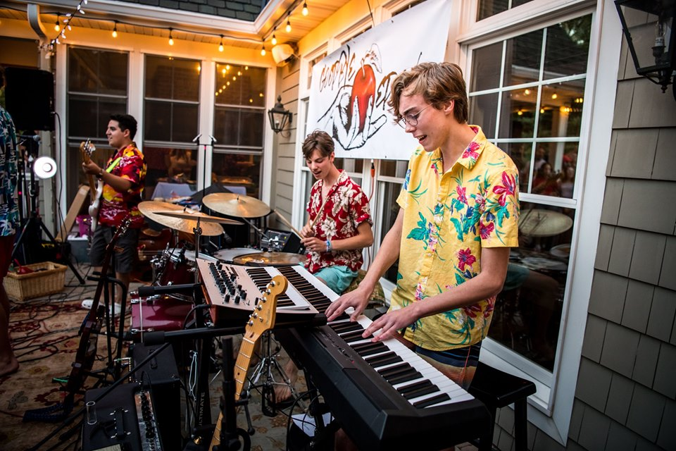

Goodbye Eden is an indie rock band given life from the suburbs of Wisconsin. Consisting of members based across the US from Los Angeles, CA to Wisconsin, these fellas get together when they can to whip up some sweet sweet jams. Coming from a variety of musical backgrounds such as jazz, mariachi, classical, funk, rock, and musical theatre, their sound is an amalgamation of each member’s ideas and experiences. Each member of GBE has a wide variety of talents, passions, and interests, giving them opportunities to discover new elements for their creative process.

In middle school, Jack (vocals/rhythm guitar), Henry (drums/percussion), and Jando (bass) met and became friends while sharing their interest in music and the arts. This shared interest blossomed into a jazz combo, The Minus One Quartet. As they matured, their music transformed to serve the three of them, transitioning their focus to a rock inspired group. The band learned and grew together musically throughout their first two years of high school, playing with an abundance of temporary members but never focusing on writing their own music.

Their Junior year, the trio decided to take their music in a more serious direction. Re-branding, they changed their name to Goodbye Eden and accepted Ben Stephan (lead guitar) as their first new permanent member. Shortly after, the need for a piano player became clear and Charlie Monroe stepped up to the keys.

The band is currently working on their second album and focusing on discovering the true sound of Goodbye Eden.

<h6>Jack Cain - Voice, Whistling and Guitar</h6>

<h6>Jando Valdez - Bass</h6>

<h6>Ben Stephan - Guitar</h6>

<h6>Charlie Monroe - Piano and Synthesizer </h6>

<h6>Henry Ptacek - Drum, Cymbals, and Percussion</h6>

