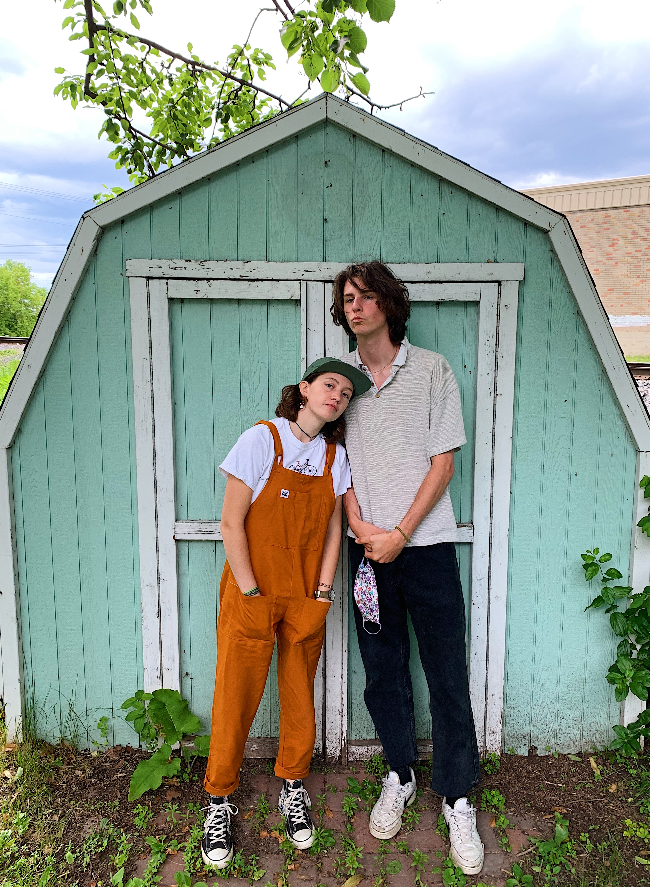
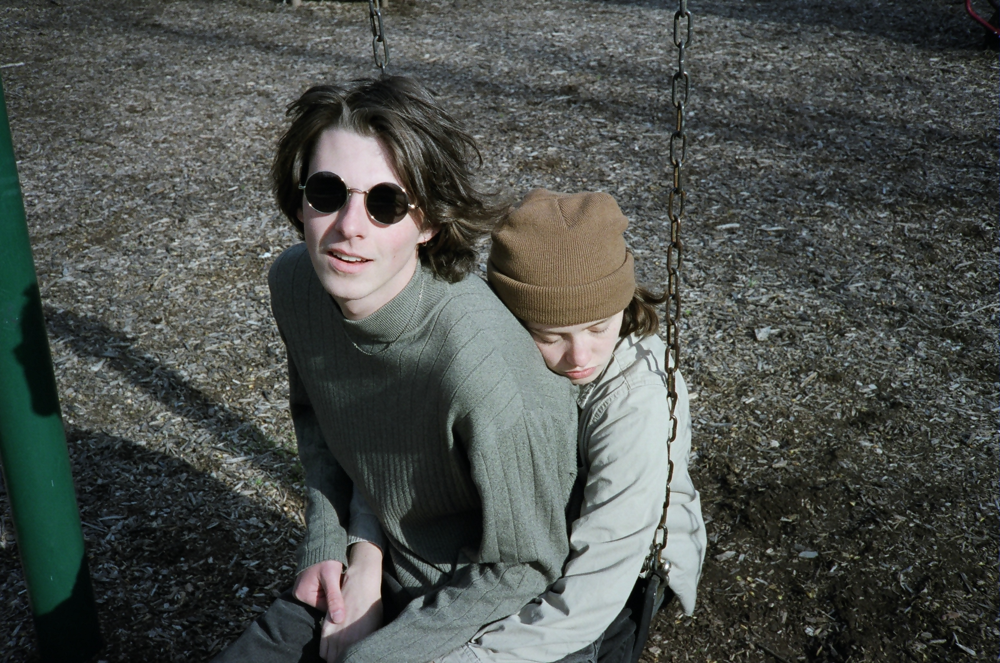

---
category: artist
title: Macy n Vinne
date: "2020-05-05"
description: "Walking the line between bedroom pop and grunge rock"
thumbnail: ./macy-n-vinne-1.jpg
facebook:
instagram: https://www.instagram.com/vinn_e_/
spotify:
youtube:
soundcloud:
tags: ["macy n vinne"]
---Macy and Vinne are more than just a music duo. They take the love they share for each other and infuse it into their music.

Vincent and Macy. A little quirky, a little odd, a little out there. That's what they love.

Vincent, more popularly known as Vinne, does not go a day without strumming on his guitars or bass.

Macy, more popularly known as Macy, tends to focus on the lyrics and melodies for the songs.

Vincent loves The Jesus and Mary Chain & The Velvet Underground while Macy drools over Bob Dylan & Crosby, Stills, Nash and Young.
