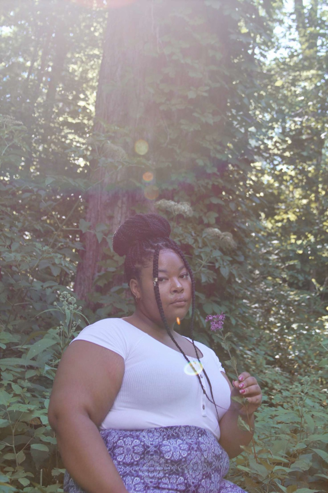

Kala Lones, better known as “poet 22” is an RnB artist based out of Appleton, Wisconsin. Kala has been singing since she was a kid and has never stopped dreaming of becoming a professional singer. Her first love was poetry, but what first started off as short poems soon turned into song lyrics. She attributes this love for poetry as the catalyst for her songwriting.

Just last year, in 2019, she released her first project on SoundCloud entitled “Perfect Timing.” Since her first release, Kala has been prolific in creating new music, working and collaborating with artists from across the United States. Poet22 finds that she’s often inspired by how her everyday situations make her feel, and that’s heard in her music. She plans to soon become a household name.

Currently she is working on two projects, the first is a project that was partially completed, last summer. This self-titled collection of work is more lighthearted, filled with beautiful love songs. For her most recent project, Kala flew out to Baltimore to work with producer Tamira Slade on Kalas most ambitious work yet. With this project she hopes to explore more deeply her unique sound.

`video: youtube.com/watch?v=Ce_bGGIbBCE`