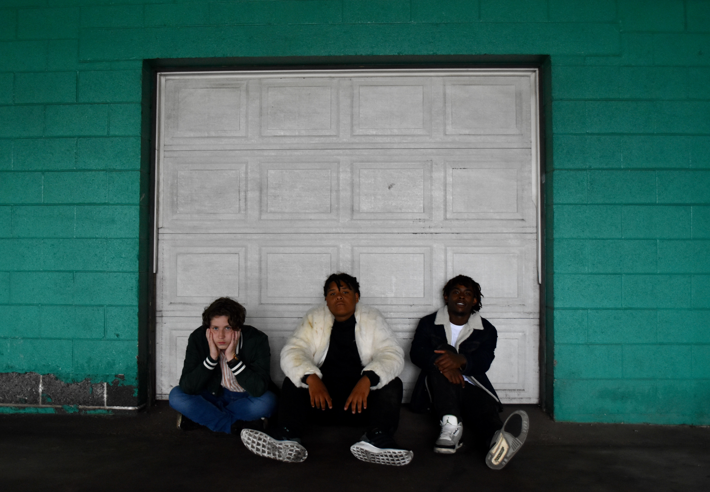
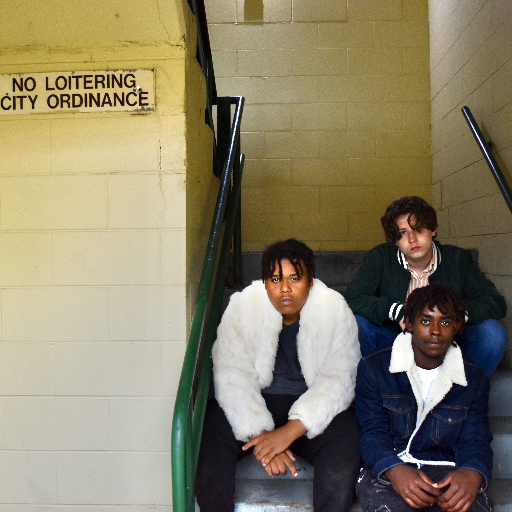
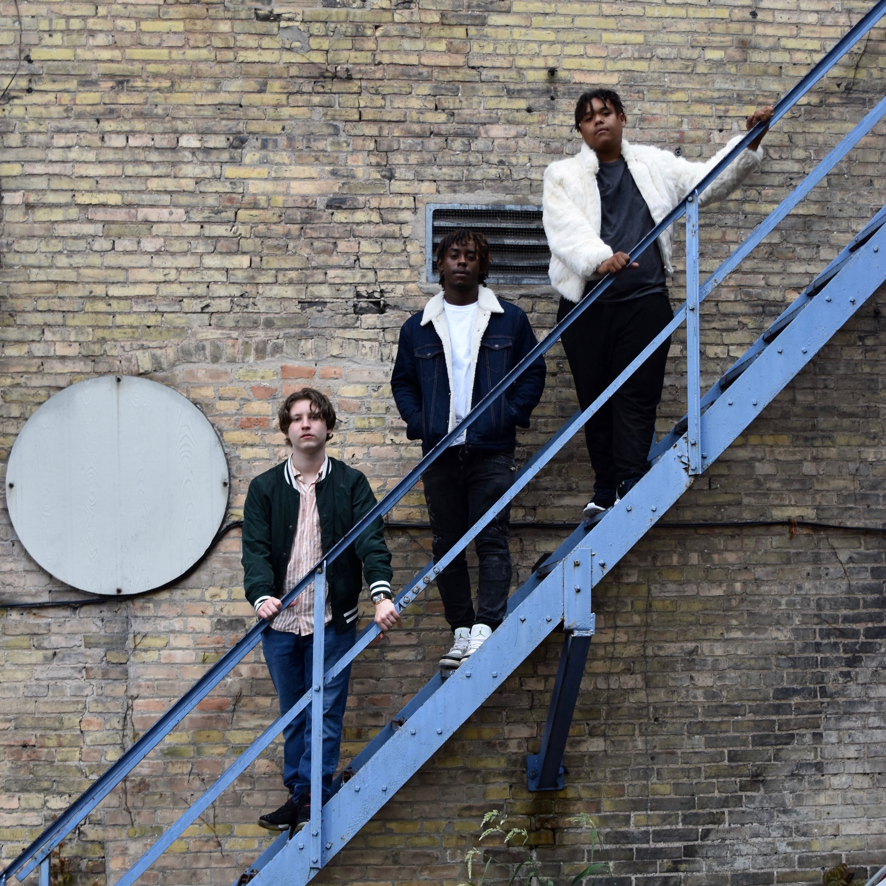
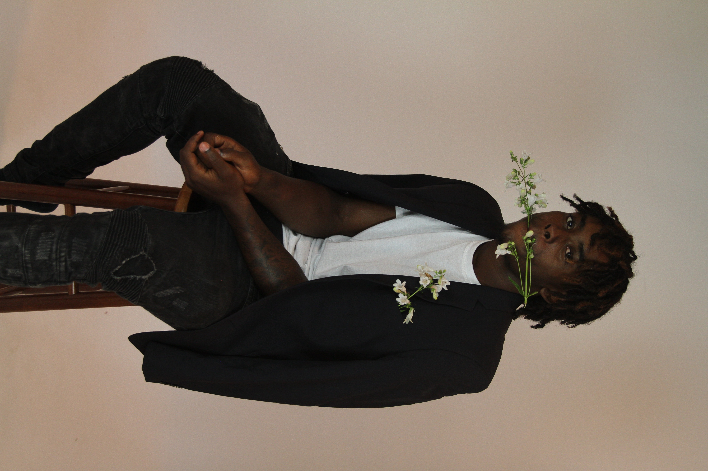
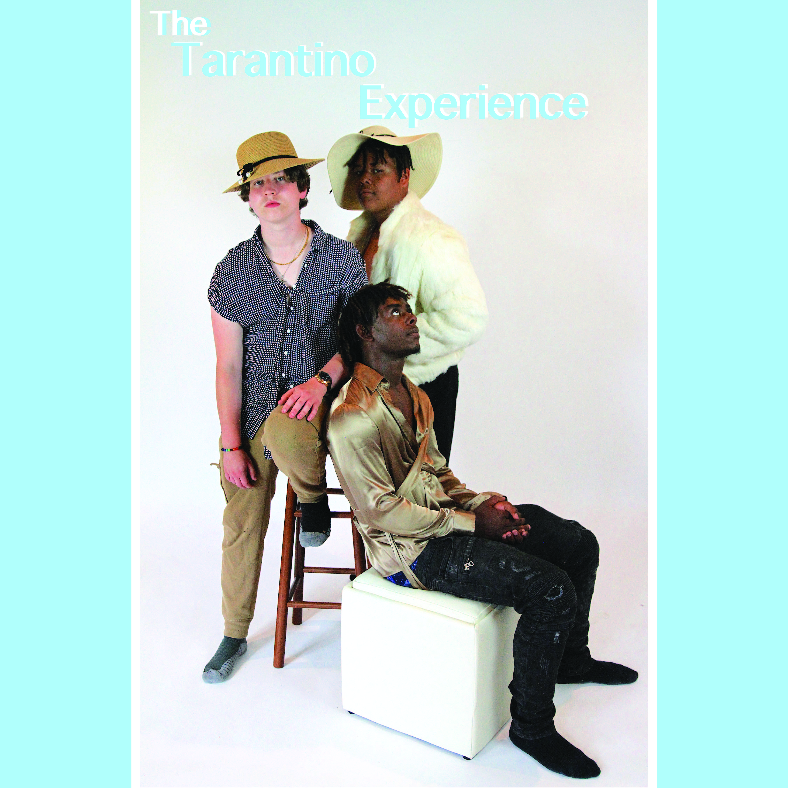

Drug infused, love enthused hip hop - when Atlanta trap meets Kanye’s midwestern influence.

The Tarantino Experience is equal parts a clashing of sounds as it is a vocal commentary of the world through the eyes of the youth, specifically what being ‘the youth’ means for three teenagers from a small city which seems devoid of opportunity. 

Gabriel Lucas, the oldest in the group has a dark more aggressive style flow and sound. This unique rap sound is coupled with his desire to comment on something he believes in with his lyrics. In addition to being a lyricist and delivering flow he has a great ear for the big picture as he mixes a lot of the work he does. 

Hopeless Dynasty is a young man exuding talent. His clever and meaningful lyricism is made possible by his insatiable desire to create. Not only does Hopeless rap but through the Tarantino Experience’s work he is the only one that is heard singing. Most of the hooks and catchy lines are courtesy of Hopeless Dynasty’s captivating voice.

AV Santana is a voice missing on Adolescence but a presence felt, the most ‘traditional rapper’ of the group, AV fills his bars with clever punchlines and his laissez-faire attitude is a key part of constructing the groups message as a whole.

Tarantino has been performing for a few years now, miscellaneous pop up shows are the norm but for about a year The Tarantino Experience were frequent acts for Kenosha collective New World Order headed by promoter Nathan Darko. Another few months was spent performing with promoter, and long time friend of Gabriel Lucas, Eddie Young and his company called BAM.

The Tarantino Experience is currently working on their first full length LP Album with producers Henry Ptacek, Jack Cain, and The Missing Link. This work is slated to be their most ambitious project yet by taking creative control of the entire process of music making. 

<!-- 

 -->

