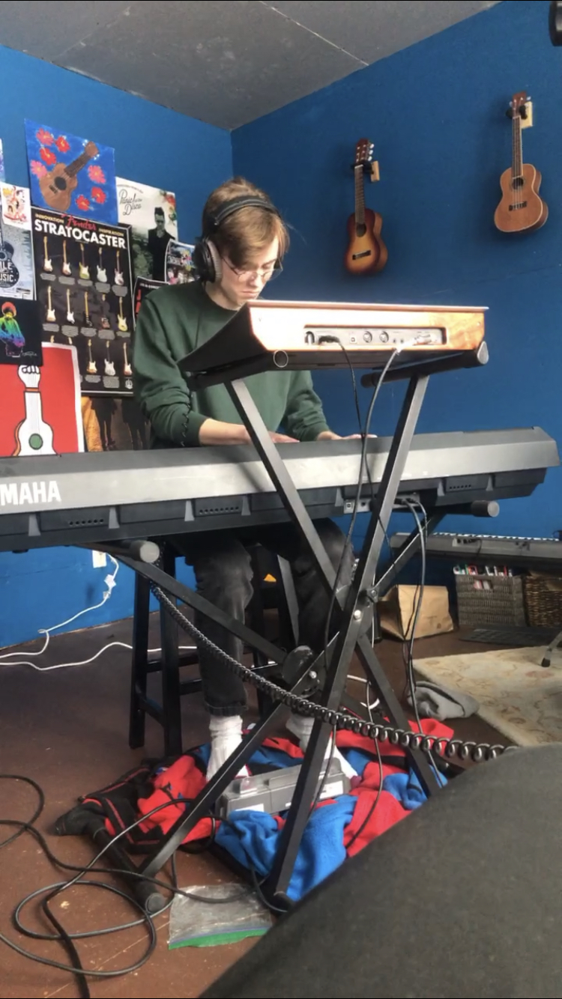

This song emerged as a counter to the heavy rock influenced 18 Daydreams. Rooted in the vibey synth line, Goodbye Eden recognized it as an immediate modern synth pop song. 

STRUCTURE:
The simple yet accumulating layers of the verse offers the audience a floating sensation and an easy storyline. The chorus is a waterfall of sound and is meant to seem powerful yet maintain the simplicity and relaxed vibe of the verse. The floating aura of the song is completed with a melodic guitar solo that encapsulates the melody of the verse and chorus into its own new moment.

